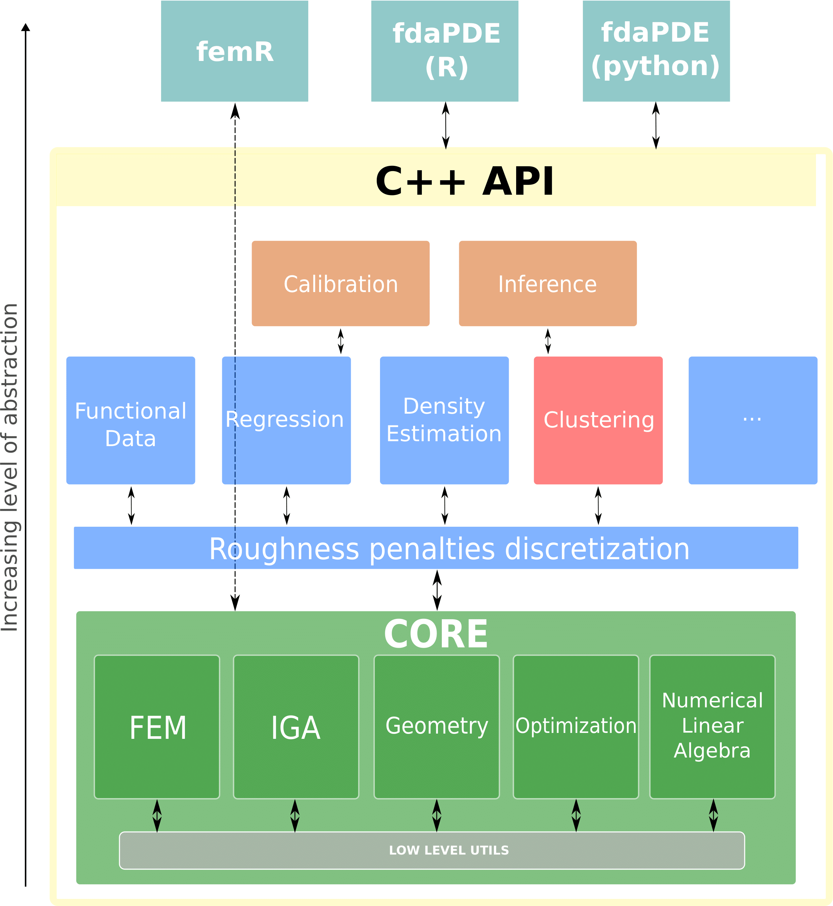
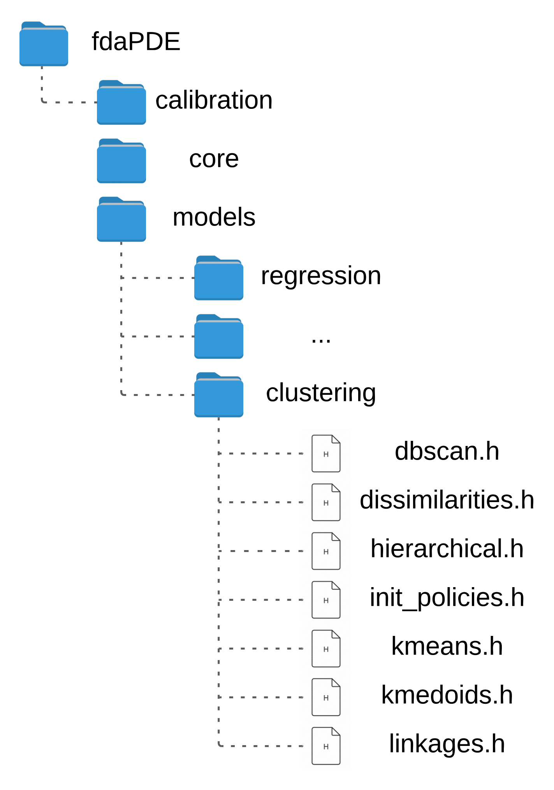

 <h1> Clustering in fdaPDE </h1>

<h5> Physics-Informed Spatial and Functional Data Analysis </h5> 

This repository is a fork of the fdaPDE, an header only C++ library for the analysis of spatial and functional data observed over complex multidimensional domains.
It is built on top of the [fdaPDE Core Library](https://github.com/fdaPDE/fdaPDE-core).

This project was developed by MSc Mathematical Engineering student Alessandro Venanzi (10723478) under the supervision of professor Laura M. Sangalli, professor Eleonora Arnone, doctor Alessandro Palummo and doctor Michele Cavazzuti. 

Contribution features the whole implemenataion of the clustering module, as well as validation tests in both full-observable and partial-observable data.
The code structure of the library is presented in the image below.

